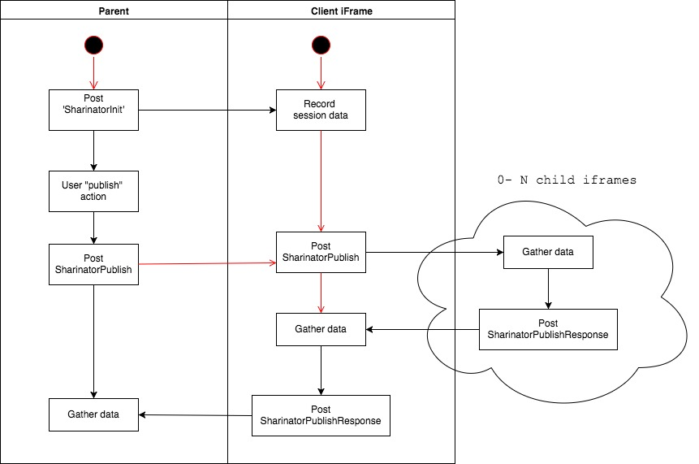

## cc-sharing client library ##

To be used by clients of the CC [Sharintor](https://github.com/concord-consortium/sharinator)

This is an attempt define [iFramePhone](https://github.com/concord-consortium/iframe-phone) message signatures
for the purpose of 'sharing' work between students and teachers.

## Details ##

There are only 3 message types defined:

1. `SharinatorInit`
    * Sends data about the session in `sharing-init` format
2. `SharinatorPublish`
    * User intiated request for new data.
3. `SharinatorPublishResponse`
    * Contents of publishable data in `Publishable` format.

## To Build: ##
1. Install dependencies: `yarn`
2. Compile `npm run build`

## Rough Messaging Diagram

